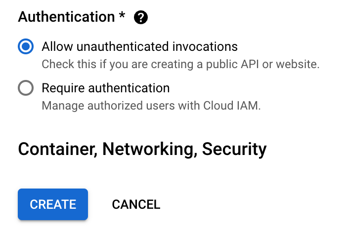

# COEN424/6313 TUT: Google Cloud Run

This tutorial will guide you on deploying any web application to Google Cloud Run as a microservice.


## 1. Reading Recommendations

Before you dive into the coding, you may study the following materials.

- How to use Git and Github: [YouTube: Git Tutorial](https://www.youtube.com/watch?v=8JJ101D3knE&t=3s), [YouTube: GitHub Tutorial](https://www.youtube.com/watch?v=tRZGeaHPoaw).

- [What is Cloud Run](https://cloud.google.com/run/docs/overview/what-is-cloud-run)? You should understand the concepts of "Cloud Run Services" and "Cloud Run Jobs."

- [Is my app a good fit for Cloud Run?](https://cloud.google.com/run/docs/fit-for-run) You should know what kind of work suits Google Cloud Run.

- [Quickstart: Deploy to Cloud Run from a Git Repository](https://cloud.google.com/run/docs/quickstarts/deploy-continuously#cloudrun_deploy_continuous_code-python)

- [Deploy a Python Service to Cloud Run from Source Code](https://cloud.google.com/run/docs/quickstarts/build-and-deploy/deploy-python-service)

- [YouTube: Docker in 100 Seconds](https://www.youtube.com/watch?v=Gjnup-PuquQ), and Dockerfile


## 2. Preliminary Setup for Workshop

1. Install the Google Cloud CLI: https://cloud.google.com/sdk/docs/install, run init.

   Verify if the tools are available by the command:

   ```bash
   gcloud -v
   ```

   And you should get the following output:

   ```bash
   Google Cloud SDK 444.0.0
   bq 2.0.97
   core 2023.08.22
   gcloud-crc32c 1.0.0
   gsutil 5.25
   ```

2. Create your Project on Google Cloud Console at https://cloud.google.com/?hl=en.

   

3. **IMPORTANT**: **Set up a billing account for your project**.

   

   If you are new to the platform, remember that the platform grants you $400+ credits once your billing is linked.

4. Authorization for the gcloud.

   You should log in first:

   ```bash
   gcloud auth login
   ```

   Then it will pull up your browser:

   

   Once allowed, you will see:

   

   Verify your login status with:

   ```bash
   gcloud auth list
   ```

   You should be able to see the following message:

   ```bash
       Credentialed Accounts
   ACTIVE  ACCOUNT
           bbbb@concordia.ca
   *       xxxxx@gmail.com
   
   To set the active account, run:
       $ gcloud config set account `ACCOUNT`
   ```

5. Configure the project for your gcloud:

   ```bash
   gcloud config set project <your-project-id>
   ```

   The project ID can be found while selecting Project in the Console.

   

6. Set up Billing information and add a payment to your account (this will charge you a refundable 1\$~2\$):

   

7. Then, use the `gcloud` on your machine to enable the following **six** Google Cloud APIs (Updated):

   ```bash
   gcloud services enable run.googleapis.com eventarc.googleapis.com storage.googleapis.com cloudbuild.googleapis.com iam.googleapis.com iamcredentials.googleapis.com
   ```

   You should be able to see the following message:

   ```bash
   Operation "operations/acf.xxxxxxxxx" finished successfully.
   ```

8. (Optional) Install Docker in your local environment to debug with your Dockerfile.


## 3. Use Case: Websites and Web Applications

There are three approaches to deploying your project as a service to Cloud Run:

1. From a published Docker image;
2. <u>from a GitHub repository;</u>
3. <u>from a local source code;</u>

> **<u>The following user scenario is presented</u>**:
>
> You are now working on deploying two web applications (one Python and one Java) to Google Cloud Run using the last two approaches.


### 3.1 Approach 1: Deploy from a Git Repository

Deploying projects on GitHub to Cloud Run can enable the CI/CD workflow between the Google Cloud Platform and GitHub.

In the `web_app_python` of this repository, a simple Flash application is included in main.py, and the Dockerfile is used to build and deploy the image for Cloud Run Service.

The `Dockerfile`:

```dockerfile
# Use the official lightweight Python image.
# https://hub.docker.com/_/python
FROM python:3.11-slim

# Allow statements and log messages to immediately appear in the logs
ENV PYTHONUNBUFFERED True

# Copy local code to the container image.
ENV APP_HOME /app
WORKDIR $APP_HOME
COPY . ./

# Install production dependencies.
RUN pip install --no-cache-dir -r requirements.txt

# Run the web service on container startup. Here we use the gunicorn
# webserver, with one worker process and 8 threads.
# For environments with multiple CPU cores, increase the number of workers
# to be equal to the cores available.
# Timeout is set to 0 to disable the timeouts of the workers to allow Cloud Run to handle instance scaling.
CMD exec gunicorn --bind :$PORT --workers 1 --threads 8 --timeout 0 main:app

```

In this section, you will focus on the `/` endpoint in the `main.py`:

```python
@app.route("/", methods=['GET', 'POST'])
def hello_world():
    """Example Hello World route."""

    return f"Hello World!!!@@@!!!"
```

Please work on the following steps:

1. Clone this repository ([YouTube: Git Tutorial, YouTube: GitHub Tutorial](https://www.youtube.com/watch?v=tRZGeaHPoaw)).

2. Go to Cloud Run and create a Cloud Run Service:

   1. Click the Cloud Run panel "CREATE SERVICE."

   2. Follow the screenshot:

      1. Select "... from a source repository";

      2. Set up Cloud Build.

      3. Select GitHub as the provider.

      4. Authorize your GitHub account.

      5. Select the repository you just cloned.

      6. Install the Google Cloud Build in your repo.

      

   3. Select the main branch; Select build type "Dockerfile" and locate the file path `/web_app_python/Dockerfile`.

      

   4. Allow unauthenticated invocations and create the service.

      

3. Your code is now created and deployed on Cloud Run.

   

4. Visit the URL of the `hello_world()` endpoint.

   

5. Make some changes in your code and commit it to the GitHub repository.

   We remove the @@@ in the code.

   

6. Visit the Build History. You should see a new build is processing.

   

7. The change should be updated to the web service.

   


### 3.2 Approach 2: Deploy from Local Source Code using Google Cloud CLI

Sometimes, you may want to deploy your local work to the cloud for debugging.

A straightforward way is to deploy your code using **Google Cloud CLI**.

In the root path of this repository, a Java application demo in the folder `web_app_java` contains all the necessary Java servlet code and the `web_app_java/Dockerfile`.

The file builds an image that runs a Java application with Maven.

This is the `Dockerfile`:

```dockerfile
FROM maven:3.9.4-eclipse-temurin-17

WORKDIR ./app
COPY . .

RUN ["mvn", "clean", "install", "-Dmaven.test.skip=true"]

ENTRYPOINT ["./mvnw", "spring-boot:run"]
```

And a simple controller in `src/main/java/com/example/web_app_java/controller/HelloController.java`:

```java
@RestController
public class HelloController {

    @GetMapping("/")
    public String index() {
        return "Greetings from Spring Boot!";
    }

}
```

Please work on the following steps:

0. [Make sure that you have the following role or roles on the project  (step 3)](https://cloud.google.com/run/docs/quickstarts/build-and-deploy/deploy-java-service#before-you-begin)

   1. Go to the **IAM** page.
   2. Click person_add **Grant access**.
   3. In the **New Principals** field, enter your user identifier. This is typically the email address for a Google Account.
   4. Add the roles: Cloud Run Admin, Cloud Run Source Developer, Logs Viewer.
   5. Save.

   

1. Once you have installed the CLI tools, you can now deploy this project with the following:

   ```bash
   cd ./web_app_java
   ```

   And run:

   ```bash
   gcloud run deploy
   ```

2. Follow the prompt: (1) stay default for source code location; (2) stay default for service name; (3) select region; (4) allow unauthenticated invocations.

   

   This will trigger the Cloud Build first to build your image. On the Cloud Build, you will see:

   

   Then, it will create a Cloud Run Service. On the Cloud Run, you will see your endpoint URL:

   

   You can now visit the URL.

   

To continually deploy your local changes, you can re-run the `gcloud run deploy` and use the same service name.
