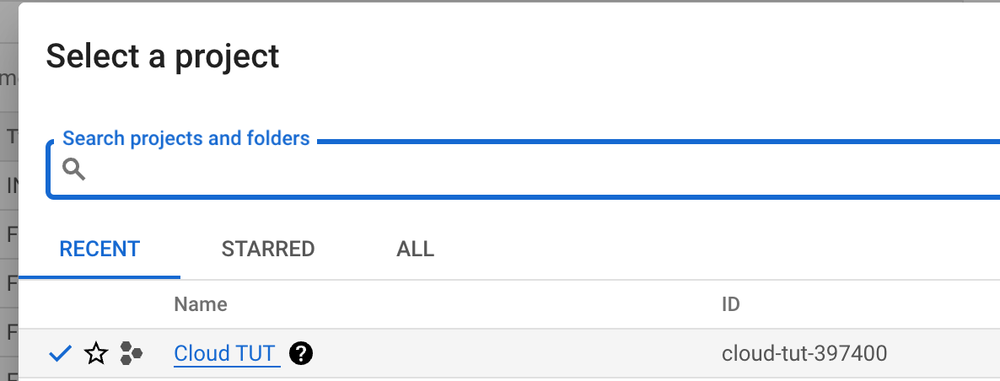

# 1. Reading Recommendations

Before you dive into the coding, you may study the following materials.

- How to use Git and Github: [YouTube: Git Tutorial](https://www.youtube.com/watch?v=8JJ101D3knE&t=3s), [YouTube: GitHub Tutorial](https://www.youtube.com/watch?v=tRZGeaHPoaw).

- [What is Cloud Run](https://cloud.google.com/run/docs/overview/what-is-cloud-run)? You should understand the concepts of "Cloud Run Services" and "Cloud Run Jobs."

- [Is my app a good fit for Cloud Run?](https://cloud.google.com/run/docs/fit-for-run) You should know what kind of work suits Google Cloud Run.

- [Quickstart: Deploy to Cloud Run from a Git Repository](https://cloud.google.com/run/docs/quickstarts/deploy-continuously#cloudrun_deploy_continuous_code-python)

- [Deploy a Python Service to Cloud Run from Source Code](https://cloud.google.com/run/docs/quickstarts/build-and-deploy/deploy-python-service)

- [YouTube: Docker in 100 Seconds](https://www.youtube.com/watch?v=Gjnup-PuquQ), and Dockerfile


# 2. Preliminary Setup for Workshop

1. Install the Google Cloud CLI: https://cloud.google.com/sdk/docs/install, run init.

   Verify if the tools are available by the command:

   ```bash
   gcloud -v
   ```

   And you should get the following output:

   ```bash
   Google Cloud SDK 444.0.0
   bq 2.0.97
   core 2023.08.22
   gcloud-crc32c 1.0.0
   gsutil 5.25
   ```

2. Create your Project on Google Cloud Console at https://cloud.google.com/?hl=en.

   

3. **IMPORTANT**: **Set up a billing account for your project**.

   

   If you are new to the platform, remember that the platform grants you $400+ credits once your billing is linked.

4. Authorization for the gcloud.

   You should log in first:

   ```bash
   gcloud auth login
   ```

   Then it will pull up your browser:

   

   Once allowed, you will see:

   

   Verify your login status with:

   ```bash
   gcloud auth list
   ```

   You should be able to see the following message:

   ```bash
       Credentialed Accounts
   ACTIVE  ACCOUNT
           bbbb@concordia.ca
   *       xxxxx@gmail.com

   To set the active account, run:
       $ gcloud config set account `ACCOUNT`
   ```

5. Configure the project for your gcloud:

   ```bash
   gcloud config set project <your-project-id>
   ```

   The project ID can be found while selecting Project in the Console.

   

6. Set up Billing information and add a payment to your account (this will charge you a refundable 1\$~2\$):

   

7. Then, use the `gcloud` on your machine to enable the following **six** Google Cloud APIs (Updated):

   ```bash
   gcloud services enable run.googleapis.com eventarc.googleapis.com storage.googleapis.com cloudbuild.googleapis.com iam.googleapis.com iamcredentials.googleapis.com
   ```

   You should be able to see the following message:

   ```bash
   Operation "operations/acf.xxxxxxxxx" finished successfully.
   ```

8. (Optional) Install Docker in your local environment to debug with your Dockerfile.
